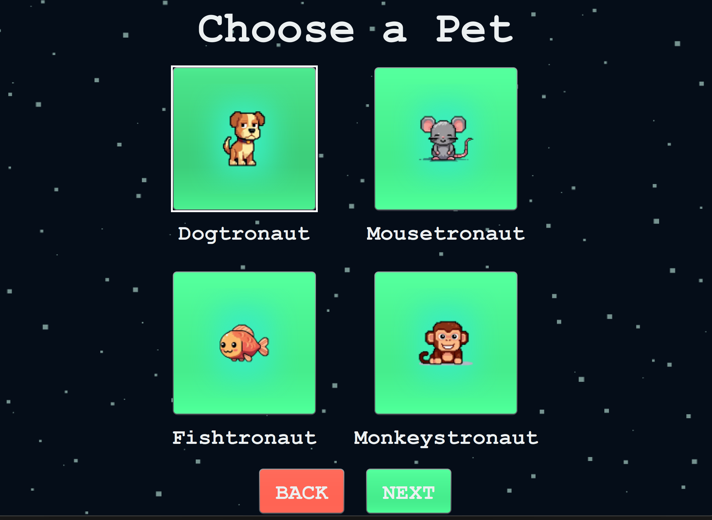

## Description
- AstroPaws is a Java-based virtual pet simulation game where players can care for and interact with their pets, while training them to go on space missions 🚀 
- The game features four different types of pets (Dog, Fish, Monkey, and Mouse; all animals that have been to space), each with unique characteristics and reactions to each player action.
- Players must maintain their pet's health, happiness, hunger, and sleep levels in preperation to prepare them for exciting space mission! Pets increase their score by going on space missions. 
- The game includes parental controls for time management and safety.

## Requirements
- Java Development Kit (JDK) 11 or higher
- Java Runtime Environment (JRE) 11 or higher
- Maven 3.9.0 or later (for building from source)
- JavaFX (included in JDK)
- JUnit 5.9.2 (for running tests, automatically fetched by Maven)
- No additional third-party libraries required

## Running from IDE (Easiest Method)
1. Open the project in your preferred IDE (IntelliJ IDEA, Eclipse, VS Code)
2. Set up the project configuration to use Java 17+
3. Run the `GUI` class located at `src/model/gui/GUI.java` as the main class
```
java -cp src model.gui.GUI
```

## Building from Source

### Prerequisites
1. Ensure you have JDK 17+ installed:
```
java -version
```
2. Ensure Maven is installed:
```
mvn -version
```

### Steps to build
1. Clone or download the repository:
```
git clone <repository-url>
```
2. Build the project using Maven:
```
mvn clean package
```
3. The compiled JAR file will be available in the `target` directory as `virtualpet-1.0-SNAPSHOT.jar`

## Running the Application

### Running from compiled JAR
1. Navigate to the directory containing the JAR file:
```
cd target
```

2. Run the application:
```
java -jar virtualpet-1.0-SNAPSHOT.jar
```

## Game Screenshots

### Main Menu


### Choose Pet


### Pet Hub


### Pet Sleeping


### Space Exploration


## User Guide

### Getting Started
When you start the game, you'll be presented with the main menu with the following options:
- **New Game**: Start a new game by selecting and naming a new pet
- **Load Game**: Continue with an existing pet
- **Tutorial**: Learn how to play the game
- **Parental Controls**: Access parent settings
- **Exit**: Close the application

### Creating a New Pet
1. Select "New Game" from the main menu
2. Choose one of the four pet types (Dog, Fish, Monkey, Mouse), each with different attributes
3. Name your pet
4. Click "Create" to start the game

### Basic Pet Care
- **Feeding** (Shortcut = F): Use food items from your inventory to feed your pet
- **Playing** (Shortcut = P): Play with your pet to increase happiness (has a cooldown)
- **Sleeping** (Shortcut = S): Send your pet to bed when they're tired
- **Gifting** (Shortcut = G): Use gifts to increase your pet's happiness
- **Vet Visits** (Shortcut = V): Take your pet to the vet when they're sick (has a cooldown)
- **Exercise** (Shortcut = E): Play with your pet to keep them healthy 

### Space Missions
1. Build up your pet's space readiness through regular care. Your pet's space readiness level increases when all other stats are above 90%
2. Once space readiness reaches 100%, send your pet on a space mission.
3. Your pet's score increases by +1 every time they go on a space mission!

### Inventory
Each pet has its own inventory of items. The player can collect randomly dropped game items every 30 seconds. The items come in two types:
- **Food**: Food items can be fed to pets to increase their fullness stat
- **Gift**: Gift items can be gifted to pets to increase their happiness stat
The inventory can hold a maximum of 20 items.

### Pet Stats
Monitor these key stats (0-100 scale):
- Health
- Sleep
- Hunger
- Happiness
- Space Readiness

### Pet States
Your pet can be in one of these states:
- **NORMAL**: Everything is fine
- **SLEEPING**: Pet is asleep and can't be interacted with until fully rested
- **HUNGRY**: Hunger level is at zero, health will decrease periodically
- **ANGRY**: Happiness level is at zero, the pet will only respond to play and gifts
- **DEAD**: Health level reaches zero, pet cannot be recovered (except through parental controls)

## Parental Controls

### Accessing Parental Controls
1. Default password: "0000"
2. Access through the game's settings menu

### Available Controls
- Set play time restrictions (start and end hours)
- View play time statistics
- Configure session limits
- Revive dead pets

## Additional Information
- Game data is automatically saved in the `data` directory
- Pet information is stored in the `data/pets` directory
- Parental settings are saved in `data/parent_config.properties`
- The game updates pet stats and automatically saves every 30 seconds

### Testing
The project includes JUnit 5 tests for backend functionality. Run the tests with:
```
mvn test
```


### Project Structure
`src/model`: Contains the core game logic
- `model/pet`: Pet classes and behaviours
- `model/item`: Items like food and toys
- `model/gui`: User interface components
- `model/assets`: Game resources (images, sounds)

`test`: Contains JUnit tests for backend logic

### JavaDocs
API documentation is available in the `docs` directory. Open `docs/index.html` in a web browser to view the documentation.

### Extra Features: Space Mission and Sound Effects
Our additional features beyond the base requirements are the Space Mission system and background music. Pets can be trained for space missions when their vital statistics are optimized, adding an extra gameplay goal and mechanic. The background music and SFX provide an extra layer of entertainment and user feedback.

### Troubleshooting
If you encounter any issues:
1. Ensure Java is properly installed and configured
2. Check that all required directories exist
3. Verify file permissions for the data directory
4. Restart the game if experiencing performance issues

## Support
For any questions or issues, please contact the development team:
- Jessica Wang
- Julia Norrish
- Yonas Asmelash
